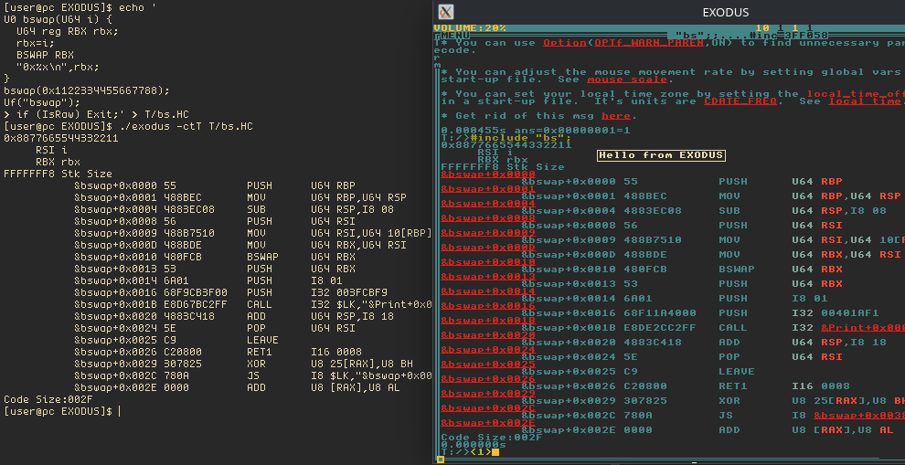
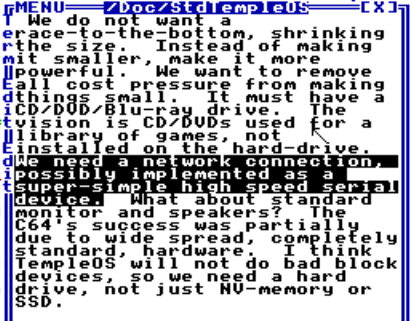

# EXODUS: Executable Divine Operating System in Userspace



EXODUS is a port of the TempleOS kernel to user space for Linux, Windows and FreeBSD.
EXODUS makes HolyC a user-space general programming language that
isn't just an exclusivity of virtual machines. It contains a mostly
full-featured GUI from stock TempleOS, and a CLI mode which has found
uses for running the networked servers automatically and building
EXODUS' kernel itself.

EXODUS is similar to [Aiwnios](https://github.com/nrootconauto/Aiwnios) in that
it provides a TempleOS experience in user space, but EXODUS runs TempleOS' orthodox
compiler and has less divergences from stock TempleOS, and Aiwnios runs on other
architectures than x86_64 through its own compiler backend, such as aarch64/riscv64.
If you're feeling experimental I recommend you try both.

# Building EXODUS

## Linux/FreeBSD

Install the packages for CMake and the development headers for SDL2.
Navigate to the directory and run these commands:

```sh
mkdir build
cd build
cmake ..
make -j$(nproc);
cd ..
```

You'll see the `exodus` binary. NOTE: `WARN`s during the build process aren't
a sign of failure.

## Windows

Windows users tend to be less technically sophisticated,
so here is a more detailed instruction:

1. Install [msys2](https://msys2.org)
2. Run "MSYS2 MINGW64" (NOTE: ***MUST*** BE MINGW64, NO SUPPORT FOR OTHER ENVIRONMENTS)
3. Run `pacman -Sy mingw-w64-x86_64-{gcc,SDL2,cmake}`
4. Run the following after navigating to the directory(Ignore any `WARN`s):
```
mkdir build
cd build
cmake ..
ninja
cd ..
```
5. You will see the `exodus` binary in the directory

# Running EXODUS

Execute the following to run EXODUS:

```sh
./exodus -t T
```

Consult `./exodus -h` for more command-line options such as CLI mode.

# Features
- Host filesystem integration (T:/ is the root drive, and Z:/ is where EXODUS was launched)
- Documentation in T:/Server (run `#include "run";` after `Cd("Server");`, on localhost:8080)
- Mostly orthodox TempleOS GUI
- CLI mode
- Community software in T:/Community, such as Satania-buddy and games like BlazeItFgt2
- Networking (Take a look at T:/Community/{gihon,HolyIRC} and T:/Server's code)

There have been some disputes on whether TempleOS can have networking or not.
To borrow the man's words, God did not ban networking.
Terry didn't implement networking in stock TempleOS because of
the line number restriction.

["God did not ban networking"](https://old.reddit.com/r/TempleOS_Official/comments/2pzdy6/can_there_be_networking/cn1kshe/) [(archived)](https://archive.is/0epu3)

Terry has also documented that the ideal TempleOS PC needs networking through a simple
serial interface. 



# Changes from stock TempleOS
- The Windows key functionality has been replaced with the Alt key
- Context switching is slower than a VM or native hardware because it runs in Ring 3, but it does not contribut to the general performance.
- Ring-0 opcodes (HLT, etc) and routines (InU8, etc) are not available

# Contributing
[Refer to this document.](./CONTRIBUTING.md)

# Very quick HolyC reference
```C
/* CTRL+SHIFT+F<num shown in autocomplete window>
 * after typing in a function name will show its src */
DirMk("folder");
Dir;
Dir("fold*");//supports wildcards
Cd("folder");
Man("Ed");
Ed("file.HC.Z");
Unzip("file.HC.Z");
Zip("file.HC");
Find("str",,"-i");//"-i" is for case-sensitivity (grep -rn . -e str)
FF("file.*");//find .|grep file
RedSeaISO("Something.ISO.C","Community");//archive folder into an ISO
MountFile("Something.ISO.C");//defaults to M
Cd("M:/");
*0=0;//Raise the debugger
DbgHelp;//help on how to debug
Shutdown;
```

# Credits

- [argtable3](https://github.com/argtable/argtable3)
- [qprocessordetection.h](https://qt.gitorious.org/qt/qtbase/blobs/master/src/corelib/global/qprocessordetection.h)
- [dyad](https://github.com/rxi/dyad)
- [map](https://github.com/rxi/map)
- [vec](https://github.com/rxi/vec)
- [isocline](https://github.com/daanx/isocline)
- [templeos-loader](https://github.com/minexew/templeos-loader)

People:

- [nrootconauto](https://github.com/nrootconauto) for getting me started with HolyC code and working on the Wiki
